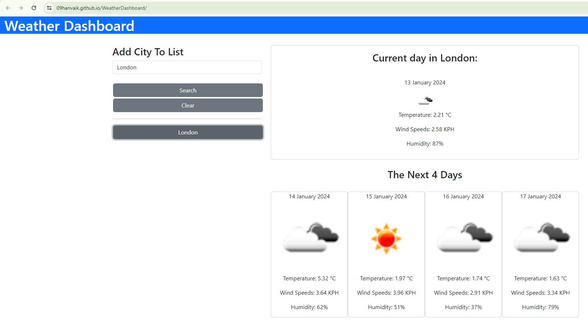

# Weather Dashboard

## Description
This project utilizes the OpenWeatherMap API to present the weather forecast for a given location. 
The user is expected to give a valid city name and the site will offers the Temperature, Windspeeds and Humidity for the cureent day and the next 4 days.

Please view the 'Credits' section below for the sources I used to implement my ideas. The US and AC below are directly taken from the Skills for Life challenge 7 (FE Bootcamp)

## User Story
AS A traveler
I WANT to see the weather outlook for multiple cities
SO THAT I can plan a trip accordingly

## Acceptance Criteria
Create a weather dashboard with form inputs.

When a user searches for a city they are presented with current and future conditions for that city and that city is added to the search history.

When a user views the current weather conditions for that city they are presented with:

The city name

The date

An icon representation of weather conditions

The temperature

The humidity

The wind speed

When a user views future weather conditions for that city they are presented with a 5-day forecast that displays:

The date

An icon representation of weather conditions

The temperature

The humidity

When a user clicks on a city in the search history they are again presented with current and future conditions for that city.

## Link to published site
https://09hanvaik.github.io/WeatherDashboard/

## Screenshot of site

## Installation

No installation steps required.

## Credits
* OpenWeatherAPI Guide: https://openweathermap.org/guide
* Generic API guide: https://rapidapi.com/blog/how-to-use-an-api-with-javascript/
